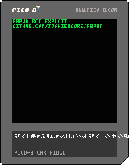

# PICO-8 v0.2.6b Sandbox Escape + RCE Exploit

PICO-8 v0.2.6b contains a remote code execution vulnerability due to a buffer overflow in `normalise_pico8_path()`. Attackers
can exploit this vulnerability to escape the PICO-8 sandbox and execute arbitrary native code on the host system as the current user. User
interaction is required to exploit this vulnerability, as the user must load and run a malicious cartridge file to trigger
the exploit.

If you have questions, comments, or hatred to share, please DM me on instagram [@joshiemoore](https://instagram.com/joshiemoore).
Followers are more likely to have their questions answered. Also, feel free to reach out if you would like to pay me to work
on something, I'm currently available for new opportunities. 

**DISCLAIMER:** Crime is illegal. This exploit and writeup are being shared publicly for the purpose of fun and education.
It's about the journey, not the destination! I am not responsible for anything you choose to do with the materials and
information contained in this repo. DFIU!

https://github.com/user-attachments/assets/3b4b1f4a-03c1-4a65-be86-adc91cc3703d

## Quickstart

If you just want to try out the PoC which pops a calculator, you can load this cart into PICO-8 and run it:



This exploit has only been tested on Windows 10, but it will most likely work on Windows 11 too.

**If you want to build your own exploit:**
1. Clone this repository.
2. Write your 32-bit x86 assembly shellcode and assemble it as a flat binary (i.e. using the `-f bin` NASM flag). You can also use the provided `popcalc.s`, which simply opens a calculator.
   Your assembled shellcode must fit within a single page, minus a few hundred bytes. So you have a little less than ~4k bytes to work with.
3. Build the exploit: `$ python3 build_exploit.py <output file> <shellcode file>`. For example: `$ python3 build_exploit.py mysploit.p8 myshellcode.bin`
4. Load the output .p8 file into PICO-8 and run it.


## Vulnerability
The core vulnerability is a buffer overflow in `normalise_pico8_path()`. This function takes the user-supplied path string
passed to `LS()` and converts it to a canonical absolute path that the PICO-8 can reason about internally. So it resolves
subdirectories, `../`, etc.

When you pass in a path containing subdirectories, like `AAAA/BBBB/CCCC`, the path is traversed, and each subdirectory name
in the path gets `memcpy()`'d into the buffer `local_51c`, one at a time:


Each subdirectory is then `strcpy()`'d into the buffer `local_41d` at the current index into the normalized path:


And so we build the full normalized path in `local_41d`. The issue is that there are no length limits or bounds checks on any of
this, so if you pass in a path containing numerous subdirectories with long names, you can overflow `local_41d` and smash the stack.
However, each directory name can only be up to 255 bytes (including the ending "/"), or `strcpy()` will end up never
hitting a null terminator. It will instead start copying from from `local_51c` into `local_41d`, then it will reach `local_41d` and just
keep on copying what it already copied until it reaches an unmapped page and triggers an AV. So if you want to actually control
the overflow of `local_41d`, you have to use several subdirectories with each being up to 255 bytes long.

## Exploit
PICO-8 v0.2.6b installs pico8.exe, a 32-bit Windows binary with no ASLR or stack canaries. The `.data` section is not executable,
so that's the main issue we need to contend with in order to fully exploit this buffer overflow.

`build_exploit.py` takes in a binary file containing assembled shellcode and outputs a `.p8` file containing the final exploit.
This Python script is the main file you should reference if you're trying to understand how this exploit works.

At a high level, the exploit works like this:
1. Overflow the buffer to overwrite the return address with ROP gadgets that pivot the stack to the second ROP stage embedded in our exploit script
2. Call `VirtualProtect()` to mark the page of memory containing our embedded shellcode as executable
3. Jump to our embedded shellcode end execute it

The biggest speedbump to developing an exploit for this vulnerability was the fact that we can't include null bytes anywhere in our Lua
strings, or in the Lua source itself. The binary gets loaded at address `0x00400000`, so we cannot directly reference addresses from the
pico8.exe binary in our ROP chain.

Fortunately, the copy of SD2.dll shipped with PICO-8 gets loaded at `0x6c940000`! So all the ROP gadgets I used in this exploit came from this DLL,
and there were plenty to choose from. I found an `xor eax, 0x39ffffff ; ret` gadget, and so this enabled me to include null bytes in values in the exploit
chain. I just had to mask them by XORing them with `0x39ffffff`. So everywhere you see `xor eax, 0x39ffffff` in the chain, that's just us unmasking
values containing null bytes. This wouldn't work if we needed to have `ff` in the low 3 bytes of the unmasked values, but we didn't in this case.

### ROP Stage 1: pivot stack to main ROP chain
If you open `p8pwn.p8` in the PICO-8 IDE, you'll notice a comment at the top with a long string of strange characters:


These characters are not for decoration. This is the main ROP chain followed immediately by our assembled shellcode. The whole point of
the first stage of this exploit is to pivot the stack to point to the location of this comment string in memory so that we can continue the ROP chain.

The string `pwn` consists of padding to fill out the `local_41d` buffer, followed by one gadget which is reponsible for actually pivoting
the stack:
```
-- pop esp ; ret
pwn = pwn.."\xf9\x73\x94\x6c"
pwn = pwn.."\x01\x91\x55\x00"
ls(pwn)
```
Here we are popping `0x00559101` into `ESP` with a gadget from SDL2.dll. `0x00559101` is the memory location where our comment string starts after the `-- `. Hardcoding the address
like this works because the binary is not using ASLR. If ASLR were used, then we would have to leak an address first, but it's not, so we don't.

You might notice that there is a null byte at the end of `pwn` even though I said we can't include null bytes. That null byte does get truncated on the Lua side,
but it gets added back in on the C side because C strings have to be null-terminated. I just included the null in `pwn` for the purpose of clarity.

So we have the malicious string `pwn`, and we pass it to the vulnerable function `LS()` which triggers the exploit and pivots the stack to ROP stage 2.

## ROP Stage 2: call VirtualProtect() to make the page containing our shellcode executable
The next thing we need to do is make it so that we can actually run our shellcode. We need to call `VirtualProtect()` to make this possible.

The comments in `build_exploit.py` pretty clearly document what's going on in this stage of the ROP chain, so I won't go into great detail here. We're just setting
up to call `VirtualProtect(<page address>, 0x1000, 0x40, &lpflOldProtect)` and then jumping to make the call.

The calling convention for `VirtualProtect()` expects arguments to be passed on the stack instead of in registers. It was EXTREMELY ANNOYING trying to mask values with
our `0x39ffffff` mask and place them on the stack for the `VirtualProtect()` call, so I gave up on that and instead tried to find a spot in pico8.exe that makes
a `VirtualProtect()` call that I could hijack. I found such a spot in the function `mark_section_writable()`:


It's beautiful, we couldn't have asked for a better setup. All we need to do is load the address of our page into `EAX`, the length into `EDX`, and an
address for `lpflOldProtect` into `EBX`. So we unmask these values with `0x39ffffff` in `EAX` and then `xchg` them into the proper registers.
We don't need the output value `lpflOldProtect`, so I just set this to point to a location right before our
comment string in memory. Really, this could be a pointer to any writable memory address.

Lastly, we have some padding to account for `mark_section_writable()` cleaning up its stack, and then we're on to the final stage of the exploit.

## Stage 3: Jump to our shellcode
This stage simply loads the address of our shellcode into `EAX` and jumps to it:
```
### &shellcode -> eax
# pop eax ; ret
rop += b'\x73\x0f\xa1\x6c'
rop += b'BBBB'
# xor eax, 0x39ffffff ; ret
rop += b'\xc7\x45\x96\x6c'

### jump to shellcode!
# jmp eax
rop += b'\x7a\x71\x94\x6c'

sc_addr = (0x00559101 + len(rop)) ^ 0x39ffffff
sc_addr_b = sc_addr.to_bytes(4, byteorder='little')
rop = rop.replace(b'BBBB', sc_addr_b)
```
We dynamically calculate the offset of the shellcode based on the length of the stage 2 ROP chain, as our shellcode is placed immediately after the ROP
chain in the comment string. The address of our shellcode is loaded into `EAX` and unmasked. We then jump to the shellcode and we have pwned the PICO-8.

## Conclusion
This exploit isn't perfect, but it's a reliable and functional PoC. We could improve it by implementing process
continuation so that the PICO-8 process doesn't just crash after the shellcode runs.

Also, it would be a good idea to remove all these hardcoded addresses from the exploit chain. Hardcoded addresses work because there is no ASLR here, but
if there was ASLR, we would need to leak an address to dynamically calculate the runtime base address of the binary in memory. We can actually do that pretty
easily with the undocumented `TOSTRING()` function from PICO-8's Lua API:

```
> PRINT(TOSTRING(LS))
FUNCTION: 0X456B60
```

This leaks the actual address of the native `_p8_ls()` C function, so we could subtract that value from the known offset of this function in the
binary in order to determine the runtime base address. I just didn't find it necessary to actually do that for this PoC.

Thanks for taking the time to read this writeup.
Follow me on [instagram](https://instagram.com/joshiemoore) if you're interested in keeping up with my activities related to reverse engineering
and binary exploitation!
